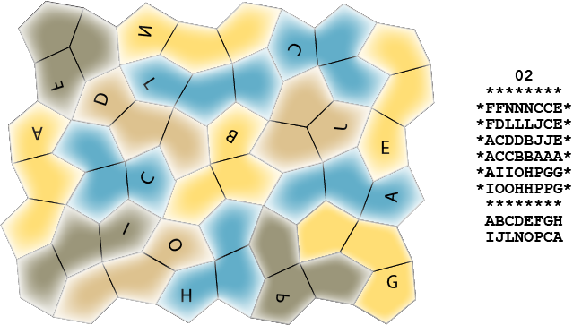

# Three-Pentagon Tiling Puzzle

This little program attempts to solve a particular tiling puzzle. The puzzle's pieces are each 
made from three identical type 8 monohedral pentagons joined edge to edge. Type 8 monohedral 
pentagons are one of fifteen classes of irregular pentagons that can tile the plane. 
(See https://en.wikipedia.org/wiki/Pentagonal_tiling.)

The these pentagons tile in the "wallpaper" style, meaning that there is a group of adjacent 
pentagons that, taken as a whole, will tile the plane purely by translation (i.e., by 
duplicating and sliding the group around appropriately). 

I have not found anything about the set of pieces that can be made from three of these 
pentagons, so I investigated the set myself. There are 146 of them. Most, however, don't appear 
in the tiling their pentagons use. Of the 146 possible pieces, only 16 participate in the tiling. 
I've labeled the 16 relevant three-pentagon pieces A, B, C, ... O, P. 

Finding solutions to puzzles made from the three-pentagon pieces is not exactly a burning problem, 
of course, but because the shape of type 8 monohedral pentagons is unusual and because the 
way they tile the plane is odd, and because many pieces tend to look like others in the set 
even though they're different, looking for solutions to a real physical instance looks like it 
should be hard. So I decided to see if there are solutions and, if there are, to make a 
physical puzzle.

The way they are arranged lets the pentagons in the tiling be treated as being arranged in 
irregular rows and columns. 

This lets them be mapped 1-to-1 and onto a simple square checkerboard tiling, which is much 
easier to deal with in a program. Applying that same mapping to the three-pentagon pieces 
results in some of the common edges degenerating into points and adds constraints on where the 
transformed pieces can be placed on the square tiling. None of this is is too complicated.

I chose a region on the tiling of the pentagons that is 8 x 6 pentagons (which is the right size 
for all 16 of the three-pentagon tiles) and has a pleasing shape as the "board" on which to build 
the puzzle. (it's the one shape in the second tiling example, above.) I then developed the program 
in this repository to search for all the ways the tiles can be placed on the board (without 
overlapping one another, of course). 

There aren't any. 

If you repeat one of the tiles, giving you sets of 17 from which to select 16 there also aren't 
any solutions no matter which you repeat. But if you select two extras, giving you sets of 18 
from which to select 16, there are solutions. 

For the record, there are 18. Here they are:

        01           02           03           04           05           06
     ********     ********     ********     ********     ********     ********
    *FFNNNCCE*   *FFNNNHHE*   *FFNNNCCE*   *FFADGLLL*   *FFBDGLLL*   *FFADGLLL*
    *FDLLLJCE*   *FJLLLHKE*   *FJMMDDCE*   *FHADGGPP*   *FBBDGGPP*   *FHADGGPP*
    *ACDDBJJE*   *AJJCCKKE*   *AJJIMODE*   *HHAMDOOP*   *NNNMDOOP*   *HHAIDOOP*
    *ACCBBAAA*   *AODDCAAA*   *AIIOOAAA*   *CJJMONBB*   *CJJMOAAA*   *CIIMONBB*
    *AIIOHPGG*   *AOBCDPGG*   *ALLLHPGG*   *CCJCMNBF*   *CCJCMHHF*   *CCGGMNBF*
    *IOOHHPPG*   *OBBCCPPG*   *EEEHHPPG*   *EEECCNFF*   *EEECCHFF*   *EEEGMNFF*
     ********     ********     ********     ********     ********     ********
     ABCDEFGH     ABCDEFGH     ACDEFGHI     ABCDEFGH     ABCDEFGH     ABCDEFGH
     IJLNOPCA     JKLNOPCA     JLMNOPEA     JLMNOPFC     JLMNOPFC     ILMNOPGF 

        07           08           09           10           11           12
     ********     ********     ********     ********     ********     ********
    *GCCBBIIF*   *FFBDGLLL*   *FFNNNHHE*   *GCCBBLLL*   *FFABBIIO*   *GCCBBLLL*
    *GGCBIDFF*   *FBBDGGPP*   *FDLLLHKE*   *GGCBDDPP*   *FHABIOON*   *GGCBEEEN*
    *NNNLLLDD*   *NNNIDOOP*   *ACDDBKKE*   *NNNIIODP*   *HHAMNNNN*   *NNNIIPPN*
    *MMEEEAAA*   *CIIMOAAA*   *ACCBBAAA*   *CMIOOAAA*   *CJJMLLLN*   *HHIDMMPN*
    *FFMOHPGG*   *CCGGMHHF*   *AIIOHPGG*   *CCMMHHHF*   *CCJCMPGG*   *HIIODDMF*
    *FOOHHPPG*   *EEEGMHFF*   *IOOHHPPG*   *EEEHHHFF*   *EEECCPPG*   *IOOAAAFF*
     ********     ********     ********     ********     ********     ********
     ABCDEFGH     ABCDEFGH     ABCDEFGH     ABCDEFGH     ABCEFGHI     ABCDEFGH
     ILMNOPGF     ILMNOPGF     IKLNOPHA     ILMNOPHC     JLMNOPNC     ILMNOPNI 

        13           14           15           16           17           18
     ********     ********     ********     ********     ********     ********
    *GCCBBIIO*   *FFNNNLLL*   *FFNNNIIO*   *FFBBBLLL*   *FFAPPLLL*   *FFBPPLLL*
    *GGCBIOON*   *FDMMEEEB*   *FDMMIOOB*   *FBBBDDPP*   *FHADPJPP*   *FBBDPJPP*
    *NNNIIPPN*   *ACDDMOBB*   *ACDDMOBB*   *NNNIIODP*   *HHAIDJJP*   *NNNIDJJP*
    *HHIDMMPN*   *ACCOOAAA*   *ACCOOAAA*   *CMIOOAAA*   *CIIMDNBB*   *CIIMDAAA*
    *HLLLDDMF*   *AIIOHPGG*   *ALLLHPGG*   *CCMMHPGG*   *CCGGMNBF*   *CCGGMHHF*
    *EEEAAAFF*   *IOOHHPPG*   *EEEHHPPG*   *EEEHHPPG*   *EEEGMNFF*   *EEEGMHFF*
     ********     ********     ********     ********     ********     ********
     ABCDEFGH     ABCDEFGH     ABCDEFGH     ABCDEFGH     ABCDEFGH     ABCDEFGH
     ILMNOPNI     ILMNOPOA     ILMNOPOA     ILMNOPPB     IJLMNPPF     IJLMNPPF 

The letters below each solution are the names of the pieces that are used in 
that solution. The last two letters tell which of the pieces were repeated. 

Here's what the solution 
repeating pieces C and A (solution 02) looks like using correctly shaped pieces:

Hopefully this example will be enough to see how to map from the output of the program to the 
"real" pieces.
