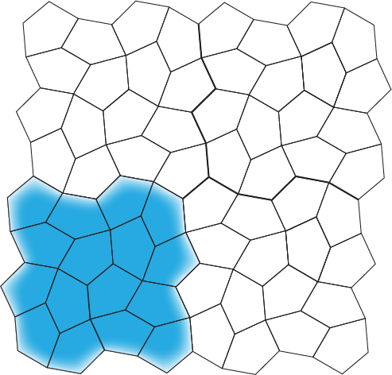
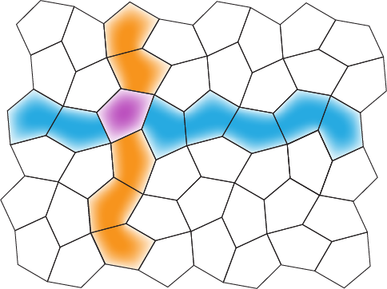
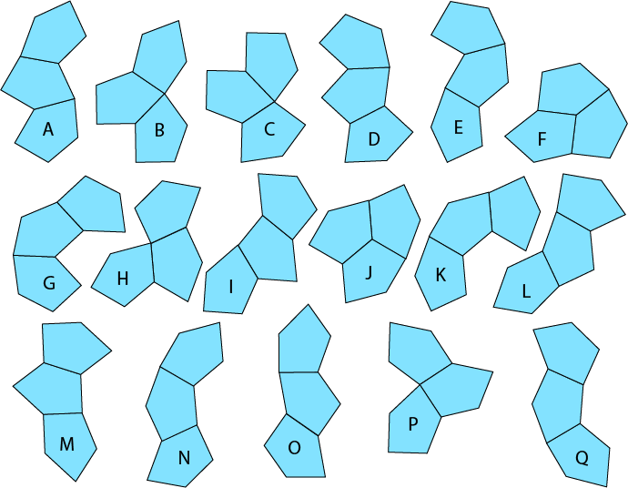
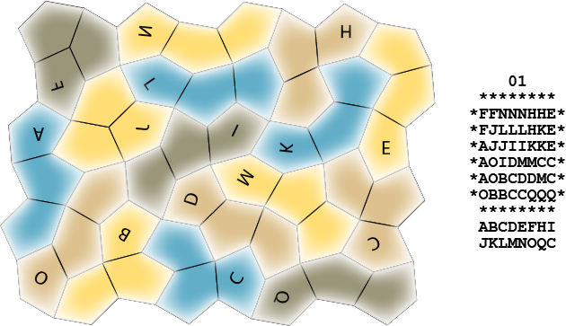

# Pentagon Tiling Puzzle

This little program attempts to solve a particular tiling puzzle. The puzzle's pieces are each 
made from three identical type 8 monohedral pentagons joined edge to edge. Type 8 monohedral 
pentagons are one of fifteen kinds of irregular pentagons that tile the plane. 
(See https://en.wikipedia.org/wiki/Pentagonal_tiling.)

The these pentagons tile in the "wallpaper" style, meaning that there is a group of adjacent 
pentagons that, taken as a whole, will tile the plane purely by translation (i.e., by 
duplicating and sliding the group around appropriately). 

The way they are arranged lets the pentagons in the tiling be treated as being arranged in 
irregular rows and columns. 

This lets them be mapped 1-to-1 and onto a simple square checkerboard tiling, which is much 
easier to deal with in a program. Applying that same mapping to the 3-pentagon pieces results 
in some of the common edges degenerating into points and adds constraints on where the 
transformed pieces can be placed on the square tiling. None of this is is too complicated.

Finding solutions to puzzles made from the 3-pentagon pieces is not exactly a burning problem, 
of course, but because the shape of of type 8 monohedral pentagons is unusual and because the 
way they tile the plane is odd, and because many pieces tend to look like others in the set 
even though they're different, looking for solutions to a real physical instance looks like it 
should be hard. So I decided to see if there are solutions and, if there are, to make a 
physical puzzle.

I have not found anything about the set of tiles that can be made from three of these 
pentagons, so I developed the set by hand. There are 17 of them. I've labeled the 17 three-
pentagon pieces A, B, C, ... O, P, Q. 

For a board, I chose a region on the tiling of the pentagons that is 8 x 6 pentagons (which 
is the right size for 16 of the three-pentagon tiles) and has a pleasing shape. (it's the one 
shown in the second tiling example, above.) I then developed this program to search for all the 
ways 16 of the 17 tiles can be placed on the board (without overlapping one another, of course). 

There aren't any.

But if it turns out that if you enlarge the set of tiles by including a duplicate of one of 
them, there are a 13 solutions.

For the record, the solutions are:

        01          02          03          04          05          06          07      
     ********    ********    ********    ********    ********    ********    ********   
    *FFNNNHHE*  *FFBPPHHE*  *QMNNNOBE*  *QMNNNHHE*  *FFNNNIIO*  *QMNNNHHE*  *FFNNNIIO*  
    *FJLLLHKE*  *FBBDPHKE*  *QMPPOBBE*  *QMLLLHKE*  *FJMMIOOB*  *QMLLLHKE*  *FJMMIOOB*  
    *AJJIIKKE*  *NNNIDKKE*  *QIMPODGE*  *QDMIIKKE*  *AJJPMDBB*  *QFMIIKKE*  *AJJPMCBB*  
    *AOIDMMCC*  *CIIMDAAA*  *IKKHCDGG*  *CDIJPPBB*  *AKKPPDCC*  *FFIJPPBB*  *AKKPPCCH*  
    *AOBCDDMC*  *CCGGMLLL*  *IKHHCCDF*  *CCDJJPBF*  *AKGGFFDC*  *GCCJJPBF*  *AKGGFFHH*  
    *OBBCCQQQ*  *EEEGMQQQ*  *EEEAAAFF*  *EEEAAAFF*  *EEEGFQQQ*  *GGCAAAFF*  *EEEGFQQQ*  
     ********    ********    ********    ********    ********    ********    ********   

     ABCDEFHI    ABCDEFGH    ABCDEFGH    ABCDEFHI    ABCDEFGI    ABCEFGHI    ABCEFGHI   
     JKLMNOQC    IKLMNPQE    IKMNOPQE    JKLMNPQE    JKMNOPQF    JKLMNPQF    JKMNOPQF   
    
    
        08          09          10          11          12          13
     ********    ********    ********    ********    ********    ********
    *QHHDFFAE*  *FFBDFFAE*  *GCCDFFAE*  *QCCBBIIO*  *FFNNNIIO*  *QHHBBIIO*
    *QHKDFIAE*  *FBBDFIAE*  *GGCDFIAE*  *QJCBIOON*  *FDMMIOOB*  *QHKBIOON*
    *QKKODIAE*  *NNNODIAE*  *NNNODIAE*  *QJJIIPPN*  *GGDDMOBB*  *QKKLLLQN*
    *PPOJINBB*  *PPOJIKKH*  *PPOJIKKH*  *HHIDMMPN*  *CGPOOAAA*  *CMDDPPQN*
    *GPOJJNBF*  *GPOJJKHH*  *GPOJJKHH*  *HLLLDDMF*  *CCPPHLLL*  *CCMMDPQF*
    *GGLLLNFF*  *GGLLLQQQ*  *GGLLLQQQ*  *EEEAAAFF*  *EEEHHQQQ*  *EEEAAAFF*
     ********    ********    ********    ********    ********    ********

     ABDEFGHI    ABDEFGHI    ACDEFGHI    ABCDEFHI    ABCDEFGH    ABCDEFHI
     JKLNOPQF    JKLNOPQF    JKLNOPQG    JLMNOPQI    ILMNOPQO    KLMNOPQQ
   
The letters below each solution are the names of the pieces that are used in the solution. The 
last letter tells which of the pieces was repeated. And here's what solution 01 looks like using 
correctly shaped pieces:

Hopefully this example will be enough to see how to map from the output of the program to the 
"real" pieces.
