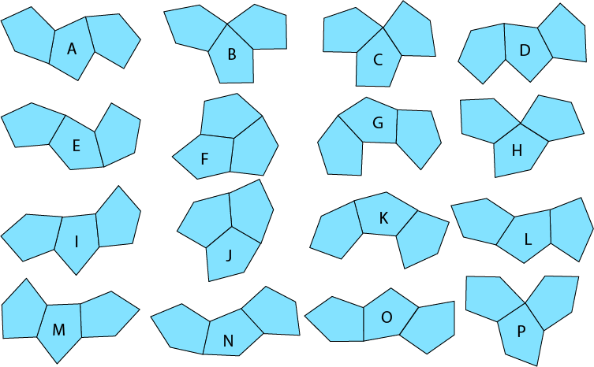
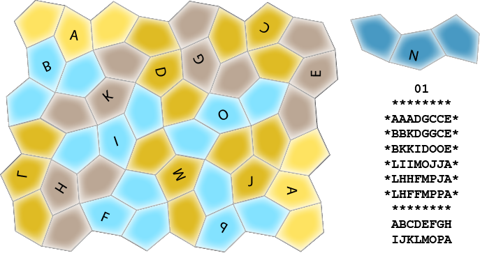

# Three-Pentagon Tiling Puzzle

This little program attempts to solve a particular tiling puzzle. The puzzle's pieces are each 
made from three identical type 8 monohedral pentagons joined edge to edge. Type 8 monohedral 
pentagons are one of fifteen classes of irregular pentagons that can tile the plane. 
(See https://en.wikipedia.org/wiki/Pentagonal_tiling.)

These pentagons tile in the "wallpaper" style, meaning there is a group of adjacent pentagons 
that, taken as a whole, will tile the plane purely by translation (i.e., by duplicating and 
sliding the group around appropriately). 

I have not found anything in the literature about the set of pieces that can be made from three 
of these pentagons, so I explored the set myself. There are 146 of them. Most, however, don't 
appear in the tiling their pentagons use. Of the 146 possible pieces, only 16 participate in the 
tiling. I've labeled the 16 relevant three-pentagon pieces A, B, C, ... O, P. 

Finding solutions to puzzles made from the three-pentagon pieces is not exactly a burning problem, 
of course, but because the shape of type 8 monohedral pentagons is unusual, because the 
way they tile the plane is odd, and because many pieces tend to look like others in the set 
even though they're different, finding solutions to a real physical instance looks like it should 
be hard. Since I like hard puzzles, I thought I'd make one.

For a physical puzzle I chose a pleasingly shaped region in the tiling of the pentagons that is 
8 x 6 pentagons (which would be the right size to hold all 16 of the three-pentagon pieces) to use 
as the "board" on which to fit the pieces. (It's the one in the rows and columns example, below.) 
Pushing the 16 pieces around in CAD quickly let me know solutions would be rare.

So I decided to write a program to look for all of them.

The way they fit together lets the pentagons in the tiling be treated as being arranged in 
irregular rows and columns. 

This lets them be mapped 1-to-1 and onto a simple square checkerboard tiling, which is much 
easier to deal with in a program. Applying that same mapping to the three-pentagon pieces 
results in some of the common edges degenerating into points and adds constraints on where the 
transformed pieces can be placed on the square tiling. None of this is is too complicated, just 
tedious to work out correctly.

The result was an earlier version of the program in this repository. It searched for all the ways 
the 16 pieces can be placed on the board (without overlapping one another, of course). 

There aren't any. 

But, I thought, what if I added a repeat one of the pieces, giving me a set of 17 from which to 
select 16. Would that relax the constraints enough for there to be solutions? So I modified 
the program. And, yes, it found some.

For the record, there are 43 solutions in which one of the 16 pieces is omitted and one is 
repeated. Here they are:

        01          02          03          04          05          06          07          08
     ********    ********    ********    ********    ********    ********    ********    ********
    *AAADGCCE*  *AAAOOHHE*  *AAAOOCCE*  *AAAFAAAE*  *FFNNNHHI*  *NCCBBLLL*  *NCCBBLLL*  *NCCDFFBE*
    *BBKDGGCE*  *DDOJJHKE*  *PDOJJICE*  *DDFFBBKE*  *FJLLLHIO*  *NDCBBBPP*  *NDCBBBHH*  *NJCDFBBE*
    *BKKIDOOE*  *ACDLJKKE*  *PPDDJIGE*  *GGDOBKKE*  *AJJCCDIO*  *NIDDBOOP*  *NIDDBFHO*  *NJJIDOOE*
    *LIIMOJJA*  *ACCLPPBB*  *LKKAIMGG*  *LGOJMMCC*  *AKKMCDOA*  *IKKMOAAA*  *IKKMFFOA*  *LIIMOKKA*
    *LHHFMPJA*  *AIILGPBF*  *LKBAFFMM*  *LPOJJIMC*  *AKGGMPDA*  *IKGGMHHF*  *IKGGMPOA*  *LPGGMKBA*
    *LHFFMPPA*  *INNNGGFF*  *LBBAFNNN*  *LPPIINNN*  *EEEGMPPA*  *EEEGMHFF*  *EEEGMPPA*  *LPPGMBBA*
     ********    ********    ********    ********    ********    ********    ********    ********
     ABCDEFGH    ABCDEFGH    ABCDEFGI    ABCDEFGI    ACDEFGHI    ABCDEFGH    ABCDEFGH    ABCDEFGI
     IJKLMOPA    IJKLNOPA    JKLMNOPA    JKLMNOPA    JKLMNOPA    IKLMNOPB    IKLMNOPB    JKLMNOPB 

        09          10          11          12          13          14          15          16
     ********    ********    ********    ********    ********    ********    ********    ********
    *NCCDGCCE*  *GCCPPCCE*  *NHHDFFBE*  *NHHDGCCE*  *NHHDFFBE*  *NHHDFFBE*  *NCCBBIIE*  *NCCBBIIF*
    *NJCDGGCE*  *GGCDPJCE*  *NHKDFBBE*  *NHKDGGCE*  *NHCDFBBE*  *NHKDFBBE*  *NJCBIHLE*  *NJCBIDFF*
    *NJJIDOOE*  *NNNIDJJE*  *NKKMDOOE*  *NKKMDOOE*  *NICCDOOE*  *NKKIDOOE*  *NJJOHHLE*  *NJJLLLDD*
    *LIIMOKKA*  *LIIMDKKA*  *LLLMOJJA*  *LLLMOJJA*  *IKKMOJJA*  *CIIMOJJA*  *PPODMMLA*  *MMEEEAAA*
    *LHHFMKBA*  *LHHFMKBA*  *GCCCMPJA*  *FFBCMPJA*  *IKGGMPJA*  *CCGGMPJA*  *GPOFDDMA*  *FFMOHPGG*
    *LHFFMBBA*  *LHFFMBBA*  *GGCCCPPA*  *FBBCCPPA*  *EEEGMPPA*  *EEEGMPPA*  *GGFFEEEA*  *FOOHHPPG*
     ********    ********    ********    ********    ********    ********    ********    ********
     ABCDEFGH    ABCDEFGH    ABCDEFGH    ABCDEFGH    ABCDEFGH    ABCDEFGH    ABCDEFGH    ABCDEFGH
     IJKLMNOC    IJKLMNPC    JKLMNOPC    JKLMNOPC    IJKMNOPE    IJKMNOPE    IJLMNOPE    IJLMNOPF 

        17          18          19          20          21          22          23          24
     ********    ********    ********    ********    ********    ********    ********    ********
    *NCCDFFBE*  *NCCDFFBE*  *NHHOOIIF*  *GCCBBIIF*  *FFBDGCCE*  *GCCDFFBE*  *FFNNNPGG*  *FFBDGLLL*
    *NJCDFBBE*  *NJCDFBBE*  *NHOMIDFF*  *GGCBIDFF*  *FBBDGGCE*  *GGCDFBBE*  *FHCJJPPG*  *FBBDGGKO*
    *NJJIDOOE*  *NJJIDOOE*  *NEEEMMDD*  *NNNLLLDD*  *NNNIDOOE*  *NNNIDOOE*  *HHCCJEEE*  *NNNIDKKO*
    *LIIMOAAA*  *LIIMOAAA*  *LLLJPPBB*  *MMEEEJJA*  *LIIMOJJA*  *LIIMOJJA*  *MMDDLLLA*  *CIIHMMOA*
    *LPGGMHHF*  *LHHFMPGG*  *GCCJJPBF*  *FFMOHPJA*  *LHHFMPJA*  *LHHFMPJA*  *FFMODIBA*  *CCHHHPMA*
    *LPPGMHFF*  *LHFFMPPG*  *GGCAAAFF*  *FOOHHPPA*  *LHFFMPPA*  *LHFFMPPA*  *FOOIIBBA*  *EEEHHPPA*
     ********    ********    ********    ********    ********    ********    ********    ********
     ABCDEFGH    ABCDEFGH    ABCDEFGH    ABCDEFGH    ABCDEFGH    ABCDEFGH    ABCDEFGH    ABCDEFGH
     IJLMNOPF    IJLMNOPF    IJLMNOPF    IJLMNOPF    IJLMNOPF    IJLMNOPF    IJLMNOPF    IKLMNOPH 

        25          26          27          28          29          30          31          32
     ********    ********    ********    ********    ********    ********    ********    ********
    *NCCDGLLL*  *NHHDGCCE*  *AAAOOHHE*  *AAAOOCCE*  *AAAOOHHE*  *AAAOOHHF*  *NLLLFFGG*  *NCCDFFBE*
    *NICDGGKO*  *NHKDGGCE*  *BBOJJHKE*  *PDOJJMCE*  *PDOJJHKE*  *PDOJJHFF*  *NDMMFICG*  *NICDFBBE*
    *NIFFDKKO*  *NKKIDOOE*  *BDFFJKKE*  *PPDDJFME*  *PPDDJKKE*  *PPDDJEEE*  *NEDDMICC*  *NIHMDOOE*
    *IBFHMMOA*  *LIIMOJJA*  *LDFJMMCC*  *LKKJFFMH*  *LLLJMMCC*  *LKKJMMCC*  *LEBBIJJA*  *IHHMOJJA*
    *BBHHHPMA*  *LHHFMPJA*  *LPDJJIMC*  *LKBJJIHH*  *FFBJJIMC*  *LKBJJIMC*  *LEBOHPJA*  *GLLLMPJA*
    *EEEHHPPA*  *LHFFMPPA*  *LPPIINNN*  *LBBIINNN*  *FBBIINNN*  *LBBIINNN*  *LOOHHPPA*  *GGLLLPPA*
     ********    ********    ********    ********    ********    ********    ********    ********
     ABCDEFGH    ACDEFGHI    ABCDEFHI    ABCDEFHI    ABCDEFHI    ABCDEFHI    ABCDEFGH    ABCDEFGH
     IKLMNOPH    JKLMNOPH    JKLMNOPJ    JKLMNOPJ    JKLMNOPJ    JKLMNOPJ    IJLMNOPL    IJLMNOPL 

        33          34          35          36          37          38          39          40
     ********    ********    ********    ********    ********    ********    ********    ********
    *FFBDGLLL*  *NCCDGLLL*  *NCCDGLLL*  *AAAOOCCE*  *AAAFNHHE*  *NCCDFFBE*  *NCCPPHHF*  *NCCPPPGG*
    *FBBDGGKO*  *NJCDGGKO*  *NJCDGGPP*  *PDOJJICE*  *DDFFNHKE*  *NJCDFBBE*  *NJCDPHFF*  *NJCDPPPG*
    *NNNLDKKO*  *NJJIDKKO*  *NJJIDOOP*  *PPDDJIGE*  *GGDONKKE*  *NJJIDOOE*  *NJJIDEEE*  *NJJIDEEE*
    *CJJLMMOA*  *LIIMPPOA*  *LIIMOKKA*  *LKKHIMGG*  *LGOJMMCC*  *LIIMOKKH*  *LIIMDKKA*  *LIIMDKKA*
    *CCJLHPMA*  *LHHFMPBA*  *LHHFMKBA*  *LKHHFFMM*  *LPOJJIMC*  *LPGGMKHH*  *LPGGMKBA*  *LHHFMKBA*
    *EEEHHPPA*  *LHFFMBBA*  *LHFFMBBA*  *LNNNFNNN*  *LPPIINNN*  *LPPGMNNN*  *LPPGMBBA*  *LHFFMBBA*
     ********    ********    ********    ********    ********    ********    ********    ********
     ABCDEFGH    ABCDFGHI    ABCDFGHI    ACDEFGHI    ACDEFGHI    BCDEFGHI    ABCDEFGH    ABCDEFGH
     JKLMNOPL    JKLMNOPL    JKLMNOPL    JKLMNOPN    JKLMNOPN    JKLMNOPN    IJKLMNPP    IJKLMNPP 

        41          42          43
     ********    ********    ********
    *NHHDFFBE*  *NHHOOIIF*  *NHHDFFBE*
    *NHKDFBBE*  *NHOMIDFF*  *NHKDFBBE*
    *NKKMDOOE*  *NEEEMMDD*  *NKKIDOOE*
    *LJJMOAAA*  *PPBBKJJA*  *LIIMOJJA*
    *LPJCMPGG*  *GPBKKPJA*  *LPGGMPJA*
    *LPPCCPPG*  *GGLLLPPA*  *LPPGMPPA*
     ********    ********    ********
     ABCDEFGH    ABDEFGHI    ABDEFGHI
     JKLMNOPP    JKLMNOPP    JKLMNOPP 

The letters below each solution are the names of the pieces that are used in that solution. The 
last letter tells which of the pieces was repeated. 

Here's what the solution repeating piece A and omitting piece N (solution 01) looks like using 
correctly shaped pieces:

This example makes it pretty easy to see how to map from "checkerboarded" output of the program 
to the actual pieces.

And here's the physical puzzle:

Yes, the pieces remind me of caterpillars and butterflies.